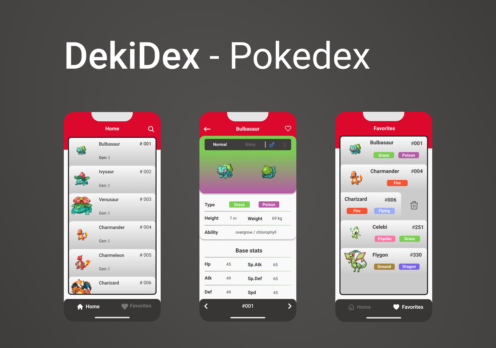

# DekiDex



# Sobre

Essa aplicação foi desenvolvida com React Native + Expo CLI, consumindo a [`PokeAPI`](https://pokeapi.co/)!

Layout no figma: https://www.figma.com/file/JJrWdyubpzNA3N4nn5oMIz/DekiDex-Pokedex?node-id=278%3A36

# Techs:

- React Native
- Expo CLI
- Typescript
- Axios
- Styled-components
- Async Storage

# Teste você mesmo

Esse projeto foi criado com [`EXPO`](https://docs.expo.dev/index.html), oque torna mais fácil o processo de teste com o emulador ou dispositivo físico.

Primeiro instale o expo-cli via terminal com o comando: 
```bash
npm install expo-cli --global
# or
yarn add global expo-cli
```

Clone esse repositório e instale todas as dependências com o comando: 
```bash
npm i
# or
yarn
```

Após ter instalado todas as dependências, via terminal use o comando: 
```bash
expo start
```

Uma nova aba será aberta em seu navegador e terá um menu com as opções de teste como: emulador android, emulador IOS ou um QR code para testar no seus dispositivo físico.

# informações úteis:

- A única maneira de emular um Iphone é possuindo um computador com o MacOS;
- Se você tiver um Iphone físico, você consegue testar a aplicação nele de maneira simple com o [`Expo Go`](https://apps.apple.com/br/app/expo-go/id982107779), esse método também é válido com um smartphone android com o [`Expo Go`](https://play.google.com/store/apps/details?id=host.exp.exponent&hl=pt_BR&gl=US) para android.
- Se você não tem um emulador configurado, você pode seguir o guia de configuração de ambiente de desenvolvimento disponibilizada na própria documentação do React Native clicando no link a seguir https://reactnative.dev/docs/environment-setup

